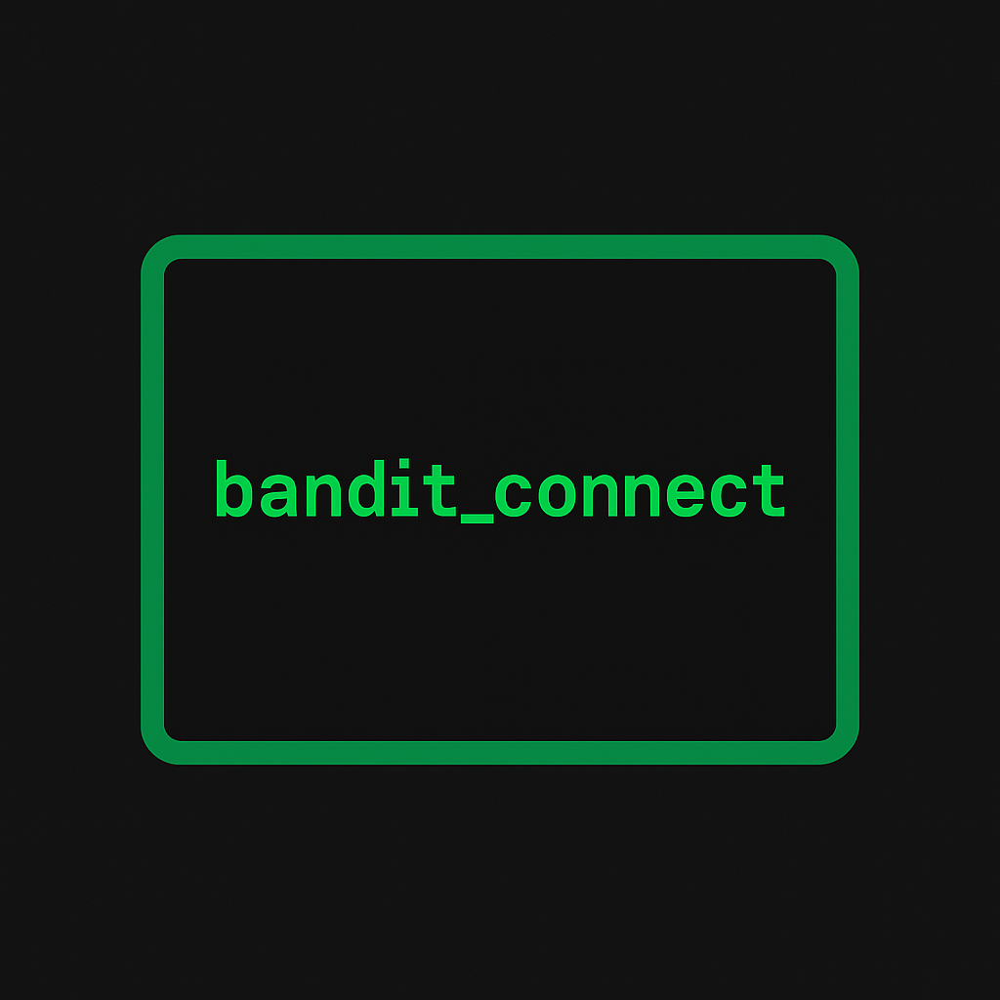
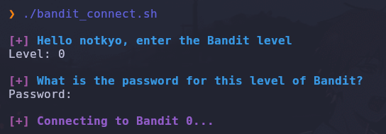

<div align="center"><i>bandit_connect 🦝</i></div>

&nbsp;

<p align="center"><a></a></p>

<br>

<div align="center">
    
</div>

## 📜 Description

 **bandit_connect** simplifies the process of connecting to different **Bandit** levels.

 ## 🚀 Usage

```bash
chmod +x bandit_connect
./bandit_connect
```
The script will ask you for

   - The level number (e.g., `0`,`13`,`23`, etc.)
   - The password for that level

Once provided, it will connect via SSH to:

```bash
banditX@bandit.labs.overthewire.org -p 2220
   ```
&nbsp;

<div align="center">
    
</div>

## 🧩 Notes

- Uses port `2220` (default for Bandit).
- Sets the `TERM` variable to `xterm` for proper shell display.

## ⚙️ Requirements

- Bash
- `sshpass`
  
  To install on Debian/Ubuntu/Kali:

```bash
sudo apt install sshpass
   ```

## 🛡️ Disclaimer

This script is intended for **educational purposes only**, specifically to assist with the **Bandit wargame** available at [OverTheWire](https://overthewire.org/wargames/).

---

**Made with ♥ by [0xnotkyo](https://github.com/0xnotkyo)** 

<p align="center"><a href="https://github.com/0xnotkyo/twt/blob/main/LICENSE"></a></p>
